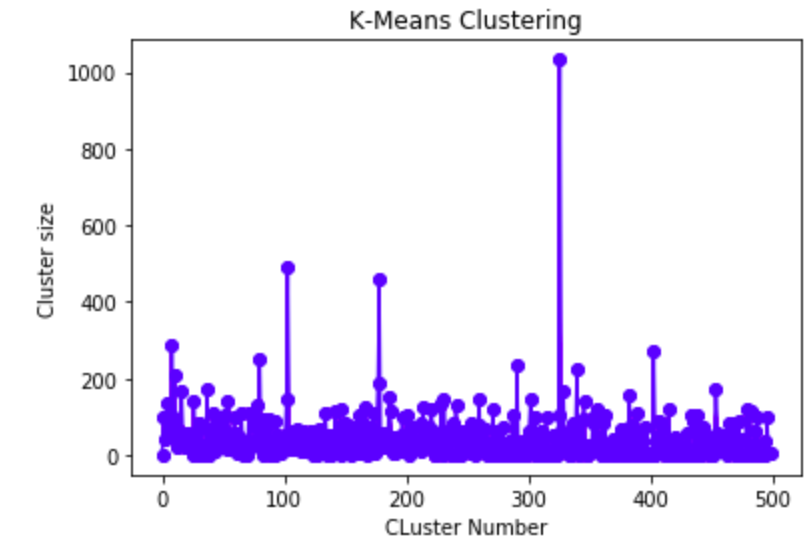
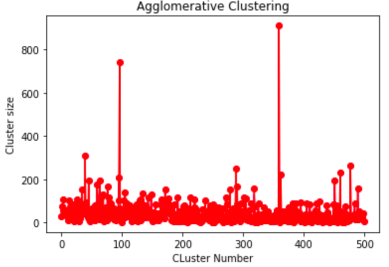
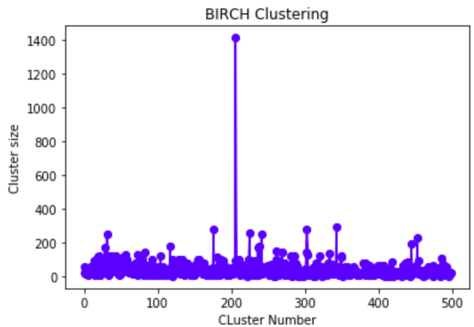
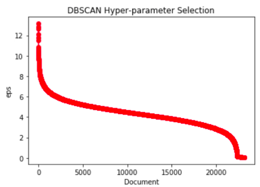

# CS5604 Information Storage and Retrieval - Fall 2019

**Team**: Text Analytics and Machine Learning

**Instructor**: [Dr. Edward Fox](https://fox.cs.vt.edu/)

**Update [01/20/2020]**: The Text Analytics and Machine Learning Teams' report, code and presentations are now available on VtechWorks! Access the content at [this HTTPS URL](https://vtechworks.lib.vt.edu/handle/10919/96226).

**Update [12/18/2020]**: A beta version of the front-end website for querying both the ETD and Tobacco corpora is accessible [here](http://2001.0468.0c80.6102.0001.7015.a60f.cf44.ip6.name:3000/)! It is running based on Elastic Search via Ceph on the Kubernetes cluster in the [CS](https://www.cs.vt.edu/)@[VT](https://vt.edu/) VM.

This repository contains code for clustering 2 large text corpora for efficient information retrieval. Please see the [data](https://github.com/pkmandke/cs5604-tml-clustering/tree/master/data) directory for details regarding the ETD and the Tobacco corpora.

## Bare Beginnings

To begin with we pre-process the ETD and Tobacco text corpora. Refer to [this](https://github.com/pkmandke/cs5604-tml-clustering/blob/f80aa07df09409f517ea4b81ad3e8b3f982f7257/src/pre_process.py#L48) method in the pre-process script for implementation details. The pre-processing phase involves the following steps:

1. Convert the entire document to lower case.
2. Remove punctuations if any.
3. Tokenize the document using a combination of an improved Tree Bank Tokenizer along with a Punkt Sentence Tokenizer. These are packaged together within the [word_tokenizer](https://www.nltk.org/api/nltk.tokenize.html) utility by NLTK.
4. Remove all stopwords that appear in the default stopwords list provided by nltk in Section 4.1 [here](https://www.nltk.org/book/ch02.html).
5. Apply nltk's default [PorterStemmer](https://www.nltk.org/_modules/nltk/stem/porter.html) for stemming the words.

## From Documents to Vectors

We use [Doc2vec](https://cs.stanford.edu/~quocle/paragraph_vector.pdf), a neural network based vector embedding computation technique proposed by Quoc Le and Tomas Mikolov. In particular, we use the distributed memory setting to train 1 vector per document for the ETDs as well as the TSRs. We only train the document vectors and do not backprop into the word vector embeddings. The size of the document embeddding has been chosen to be 128 based on heuristics. In so far as implementation is concerned, we use Gensim's [Doc2vec class](https://radimrehurek.com/gensim/models/doc2vec.html#gensim.models.doc2vec.Doc2Vec) for training the models. Note that in the case of ETDs, we train the document vectors purely on the basis of the abstracts of the documents which are contained in the 'abstract-description' field of the metadata. For more details, refer to the [ETD results](src/ETD_results.ipynb). Refer to [this](https://github.com/pkmandke/cs5604-tml-clustering/blob/f80aa07df09409f517ea4b81ad3e8b3f982f7257/src/pre_process.py#L22) script for details.

## K for Clustering

We implement and evaluate the following clustering techniques for the ETD and/or Tobacco corpora.

1. K-Means clustering
2. Agglomerative Clustering
3. DBSCAN
4. BIRCH

### Clustering ETD Corpus

> For details of these results, please refer to our report [here (PDF)](https://vtechworks.lib.vt.edu/bitstream/handle/10919/96226/TMLreport.pdf?sequence=15&isAllowed=y).

Using the Doc2Vec vectors generated from the ETD corpus, we employ the below clustering techniques and present their results.

#### K-Means Clustering

We clusterize the 128-d Doc2Vec vectors computed from the abstracts of 30961 ETDs into 500 clusters. The number of clusters were cross-validated over the Silhouette Index. Insignificant variations in the Silhouette score for clusters ranging from 350 through 800 were observed. Thus, 500 was chosen as the final cluster size since this results in a total of approximately 60 documents (in the expected value) in every cluster which was found to be reasonable. We compute 500 clusters with more parallel workers to speed up the training. Here, we present a pointwise cluster histogram below.
 

 
The average documents per cluster is 46.28, which is close to the uniform document to cluster allocation case with ~60 documents for each cluster. The standard deviation of the cluster sizes is 68.70.

#### Hierarchical - Agglommerative Clustering

We apply Agglommerative Clustering to the Doc2Vec embeddings obtained from the abstracts from all of the 30961 documents from the ETD corpus. We employ a Ward based linkage along with the Euclidean distance measure for generating 500 clusters. The point-wise cluster histogram is shown in the figure below.
 

 
The average documents per cluster is 46.28 and the standard deviation is 64.87.

#### Birch

Birch is a clustering algorithm designed to be memory and compute efficient when dealing with large scale databases. It works by iterating through the given corpus once and developing an initial cluster assignment and then (optionally) performing further iterations to improve the initial assignment. We apply Birch only to large scale corpora and not to the initial sample data subsets. There are two crucial hyper-parameters involved in Birch, the threshold and the branching factor. The branching factor limits the number of sub-clusters in a node and the threshold limits the distance between the entering sample and the existing sub-clusters. We set the branching factor and threshold to 50 and 0.5 respectively. We do not perform hyper-parameter selection for Birch as we find that the defaults work reasonably well. The point-wise cluster histogram for Birch with the ETD corpus is shown below.
 

 
The average cluster size for Birch with the ETD corpus is 46.28 and the standard deviation is 74.61.

#### DBSCAN

We apply DBSCAN to the ETD corpus on the _Doc2Vec_ embeddings obtained from the abstracts of the 30961 ETDs. DBSCAN \[[1](#References)\] is a density based clustering algorithm designed for large scale spatial databases with noise. Particularly, it has very few corpus specific hyper-parameters to be tuned which makes it easy to adopt for a myriad of massive data corpora without extensive mining. Section 4.2 of the DBSCAN paper \[[1](#References)\], describes a graphical technique to choose the hyper-parameters _eps_ and _minPts_. We perform a hyper-parameter search for _eps_ for values of _minPts_ ranging from 3 through 10. In each case, only minor differences are observed with respect to the curvature point in the graph. As a sample, the below figure shows a plot of _eps_ for each document. However, we do not obtain satisfactory results with DBSCAN for clustering the ETDs based on abstracts. The clustering is trivially wrong as all documents are allocated to the noisy clustering. It should be noted that DBSCAN can detect noisy documents. This means that it will only allocate documents to a cluster if the resulting cluster dimensions and distances are within a threshold (_eps_). In our case, DBSCAN assigns all clusters to the noise class and fails to perform the clustering successfully.
 

 

# Authors

[Prathamesh Mandke](https://pkmandke.github.io/)

[Sharvari Chougule]()

[Adheesh Juvekar]()

# Acknowledgements

To begin with, we would like to thank [Dr. Fox]((https://fox.cs.vt.edu/)) for his constant support and encouragement towards taking this work towards completion. We are grateful to all the teams from the CS-5604 class for synergistically ensuring the success of getting the system up and running (A beta version is accessible [here](http://2001.0468.0c80.6102.0001.7015.a60f.cf44.ip6.name:3000/)). Thanks are also due to [Dr. David Townsend](https://management.pamplin.vt.edu/faculty/directory/townsend-david.html), Assistant Professor at the [Pamplin College of Business](https://pamplin.vt.edu/) at Virginia Tech for his insights into understanding the Tobacco corpus to better direct the clustering efforts.

# References

    1. @INPROCEEDINGS{Ester96adensity-based,
    author = {Martin Ester and Hans-peter Kriegel and Jörg Sander and Xiaowei Xu},
    title = {{A density-based algorithm for discovering clusters in large spatial databases with noise}},
    booktitle = {},
    year = {1996},
    pages = {226--231},
    publisher = {AAAI Press}
    }

    2. @article{Zhang:1996:BED:235968.233324,
    author = {Zhang, Tian and Ramakrishnan, Raghu and Livny, Miron},
    title = {{BIRCH}: {An Efficient Data Clustering Method for Very Large Databases}},
    journal = {SIGMOD Rec.},
    issue_date = {June 1996},
    volume = {25},
    number = {2},
    month = jun,
    year = {1996},
    issn = {0163-5808},
    pages = {103--114},
    numpages = {12},
    url = {http://doi.acm.org/10.1145/235968.233324},
    doi = {10.1145/235968.233324},
    acmid = {233324},
    publisher = {ACM},
    address = {New York, NY, USA},
    }
